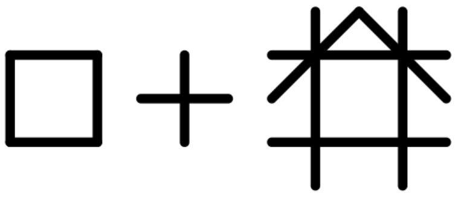
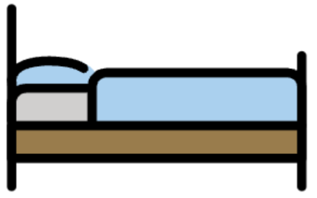
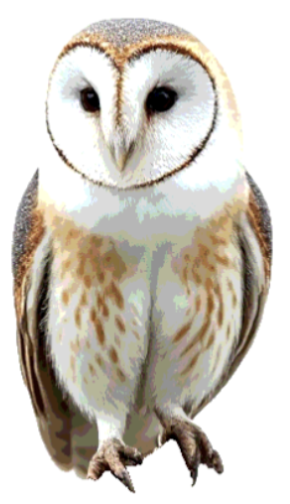

# Symbol Retrieval Using Multimodal Embeddings: An Evaluation on Global Symbols 

Ricardo Matsumura Araujo (AI Advisor), Katherine Hoffmann Pham (AI Lead) \
Frontier Tech Team, Office of Innovation, UNICEF

## Introduction

**Context**: The Frontier Technology Team at UNICEF’s Office of Innovation has embarked on a project to automate the generation of Easy Read content from original sources using LLMs. Part of the pipeline involves matching an Easy Read sentence to an accompanying image. One potential approach is to conduct semantic retrieval on a large dataset of images, using a textual description to find an adequate representation within this image dataset. We are working with Global Symbols to access a large dataset of potential symbols. Global Symbols source and make available styled symbols that can be used in various contexts.

**Goal**: to understand the performance of different multimodal embeddings when used to retrieve symbols, in particular from Global Symbols, based on textual descriptions.

**Why**: symbols are simplified representations of objects, people and concepts and may be underrepresented in the training data of embedding models, which are typically trained on datasets dominated by naturalistic images such as photographs. Therefore, embedding models might not work well with symbols. Furthermore, different models may perform differently, and identifying the best models is crucial for the success of this part of the pipeline.

## About Semantic Search

One problem with retrieving images via keyword search is that a user might not specify the correct or optimal keyword(s). For example, a user looking for images associated with “dog” might miss images labeled “puppy” or “hound”. Semantic search is an improvement over keyword search because it relies on the meaning of words rather than exact keyword matches when retrieving results. Semantic search is made possible by embedding models. 

## About Embeddings

Vector embeddings are fixed-length numerical representations of unstructured data such as text, images, or audio. They address a key challenge in machine learning: most models operate on numerical inputs of uniform shape, while real-world data often comes in variable, symbolic, or high-dimensional forms.

Rather than assigning arbitrary numbers to discrete items (e.g. word-to-index mappings), embeddings are typically learned through training objectives that capture semantic similarity. This process involves encoding input data into a vector space where related items—those with similar meaning or context—are positioned close together. The resulting vectors preserve structural and relational properties of the original data, enabling models to reason over content in a way that reflects underlying patterns and meaning.

Multimodal embeddings extend this idea by jointly representing different data types—such as text and images—in a shared vector space. Models like CLIP learn these embeddings by training on aligned pairs (e.g. an image and its caption), encouraging semantically related inputs from different modalities to map to nearby vectors. This enables cross-modal reasoning: for example, the embedding of an image of a cat would be expected to be close to the embedding of the word “cat”.

## Methods

**Data:** The data was obtained from Global Symbols. Each symbol contains the image and a single keyword describing it. The keyword was obtained from the `name` field in the metadata, which for some sets is the same keyword used in the file name.

**Embedding models**: both open and closed multimodal models were evaluated. Open-weight models from Hugging Face's SentenceTransformers were used. Closed models chosen were Cohere's (*embed-v4.0*) and Google's (*multimodalembedding*) models, which are multimodal models. Neither Anthropic nor OpenAI provide a multimodal embedding model.

**Evaluation**: each symbol had its image and keyword encoded using each model, generating a pair of embeddings (image and text embeddings). For each model and each symbol, we ranked the image embeddings by their distance to the corresponding text embedding (cosine distance) and observed the position of the corresponding image embedding. 

To evaluate retrieval effectiveness, we used two standard metrics: Mean Reciprocal Rank (MRR) and Recall@5. MRR measures the average position of the first relevant result across queries, placing greater emphasis on highly ranked correct matches. It captures how early in the ranked list a correct symbol appears. A higher MRR indicates that the correct symbol is retrieved closer to the top.

$$
\text{MRR} = \frac{1}{N} \sum_{i=1}^{N} \frac{1}{\text{rank}_i}
$$

where $N$ is the number of queries and $i$ is the rank position of the first relevant (correct) result for the i-th query. 

Recall@5, on the other hand, quantifies how often the correct image appears within the top five retrieved results. It reflects the model's ability to include relevant results among the top-ranked candidates, regardless of their exact positions. While MRR focuses on where the match occurs, Recall@5 captures whether it occurs within a small, practical shortlist.

A maximum of 500 images were used for each symbol set. The images were randomly chosen. 

## Results

The mean MRR and Recall@5 for each model is represented in the table below (higher is better), with the best closed-weight and open-weight models highlighted.  Google's multimodal model provides the best overall performance, while *openclip-vit-bigG-14* is the best open-weight model ranking in third place overall. Cohere's embed-v4.0, another closed-weight model, ranks second. 

Concretely, a Recall@5 of .581 for Google’s multimodalembedding model means that 58% of the time, when searching a keyword, the image originally associated with the keyword is among the top 5 results. This is only an approximate indicator of the quality of the results retrieved, as the other images in the top 5 might be equally good or better matches for the keyword.

| Model | MRR | Recall@5 |
|-------|-----|----------|
| google-vertex-multimodal | 0.478 | 0.581 |
| embed-v4.0 | 0.447 | 0.540 |
| openclip-vit-bigG-14 | 0.416 | 0.516 |
| clip-vit-large-patch14 | 0.383 | 0.483 |
| openclip-vit-base-patch32 | 0.364 | 0.456 |
| clip-vit-base-patch32 | 0.310 | 0.406 |
| clip-vit-b-32-multilingual | 0.113 | 0.152 |
| openclip-RN50-yfcc15m | 0.070 | 0.093 |

[The full results can be found on a separate spreadsheet](https://unicef-my.sharepoint.com/:x:/g/personal/rmatsumura_unicef_org/EaaZc-ywFf5JohavR8Y2qkYBTBTXATRicWigDItmsN8l3Q?e=BLXupm). 

**Multilingual performance**

Most symbol sets contain English keywords, but five are non-English: Bulgarian, Macedonian, Serbian, Montenegrin and Albanian. The first four are closely related, being Slavic languages. 

All models have a significant decrease in performance for non-English sets. Cohere's model outperforms Google's in non-English symbols, by a significant margin, but is still much worse than for English sets (mean Recall@5 is 0.38 vs 0.6 on all sets). No closed model came close to Cohere's model in these sets, including the model *clip-vit-b-32-multilingual* that was explicitly trained for multilingual settings. *openclip-vit-bigG-14* performed slightly worse than Google's model for these sets (mean Recall@5 is 0.21 vs 0.24).

**Open-weight performance**

Compared to Google's *multimodalembedding* on individual sets, *openclip-vit-bigG-14* is slightly better in two sets – Birds (+2%) and SEA (+10%)  and underperform significantly in a few, notably Dyvogra (-44%), Link (-59%), Otsimo (-35%)  and Tawasol (-34%).

**Hard sets**

For two sets, no models were able to perform minimally well, with recall and MRR close to zero: Blissymbolics, Guemil. Blissymbolics is extremely abstract, and it was expected that it would not allow for proper retrieval. Guemil contains very abstract representations, but also some concrete ones; still no models were able to perform adequately.

### Hard Sets Examples

 
Assembly Point (Guemil set)  

 
Accessory (Blissymbolics set)  

**Easy sets**

The best performing sets (over 75% Recall@5) were, as would be expected, those that provide concrete, realistic representations. In particular Mulberry, OpenMoji, Birds and Weather. 

Surprisingly, Sclera performed well (best Recall@5 of 74%), even though it contains many abstract representations that are similar to Guemil. It is not clear why, but one possibility is that this set is at least partly represented in the training of these models.

### Easy Sets Examples

 
Aeroplane (Mulberry set)  

 
Bed (OpenMoji set)

 
Barn Owl (Birds set)

 
Lightning (Weather dataset)

 
Accept Criticism (Sclera set)

## Conclusions

* Closed-weight models outperform open-weight models: both Cohere's and Google's models performed better than all open-weight models in most sets; nonetheless, Open-Weight models, in particular *openclip-vit-bigG-14*, can be competitive in most cases but are less consistent across sets.
* Non-English performance is a major weakness: at least for the languages evaluated (English, Bulgarian, Macedonian, Serbian, Montenegrin and Albanian), models performed much worse in non-English sets. Cohere's model is by far the best model for these languages. However, it would be expected that all models would perform much better in higher-resource languages such as Spanish or French, so further testing is needed. 
* Symbol abstractness impacts performance: all models perform better on more concrete representations. They fail to retrieve relevant results on highly abstract sets.

**Overall, the use of embedding models to retrieve images based on text is viable if text is in English (or possibly some other high-resource language) and the images are concrete representations. If these conditions are met, using closed-weights models provides the best performance, but some open-weights models can be very competitive even if less consistent across different sets.**

The above conclusion applies to text-to-image retrieval. If all images include keywords or descriptions, a better approach would be to work directly with these textual elements—that is, to create embeddings of the text content instead of the images, or alternatively, to merge the two representations making use of the fact that embeddings can typically be summed and then normalized to integrate their semantics.

### Conclusion for OOI EasyRead project

In this project, we can control for language and ensure that all retrieval is conducted in English by translating keywords, when necessary, prior to retrieval. However, the concreteness of the symbols significantly affects performance. Multimodal retrieval becomes recommended only as a last resort for abstract symbols that lack alternative textual representations. One potential direction for experimentation is to use a multimodal LLM to generate more elaborate captions for these abstract symbols, and then match the embeddings of those captions to EasyRead sentences.

### Conclusion for Global Symbols

Using *image* embeddings as the primary method for symbol retrieval does not appear to be the most effective approach in this context. This is because all Global Symbols include associated textual labels or descriptions, which already provide a rich source of information for matching queries. Instead of relying on the visual features of the images, it is more appropriate to work with these textual representations directly. 

Creating embeddings for the text associated with each symbol—such as keywords, labels, or captions—can still be valuable. These text embeddings allow for semantic search, enabling the system to interpret the meaning behind a user's query and return relevant symbols even when the exact wording does not match. For instance, a search for "doctor" could retrieve symbols labeled "physician" or "medical professional," as their embeddings would be close in the semantic space. This approach supports more flexible and meaningful retrieval without depending on image similarity, which may be less reliable or informative given the nature of the symbol set.

## Caveats

One limitation of the evaluation approach is its reliance on a single keyword-image pairing per symbol as the ground truth, which assumes that only the originally labeled image is a correct match for the keyword. This framing does not account for cases where multiple symbols could plausibly represent the same concept, especially for general or *polysemous* terms—words that have multiple related meanings (e.g., “bank” can refer to a financial institution or the side of a river). As a result, models may be penalized for retrieving semantically appropriate alternatives that are not the exact original match. Additionally, the use of only a single keyword to represent each symbol constrains the semantic expressiveness of the retrieval query, particularly for abstract concepts or symbols with context-dependent meanings. This setup may disadvantage models that rely on richer textual input or that are better suited to capturing nuanced relationships between text and image.
